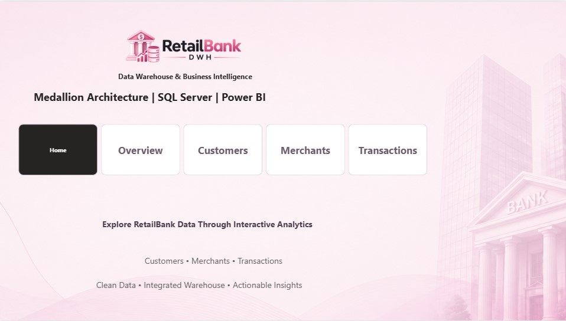
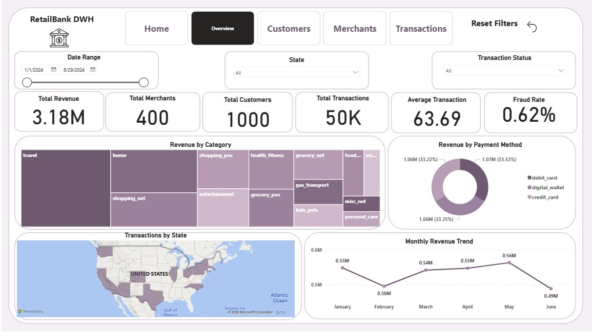
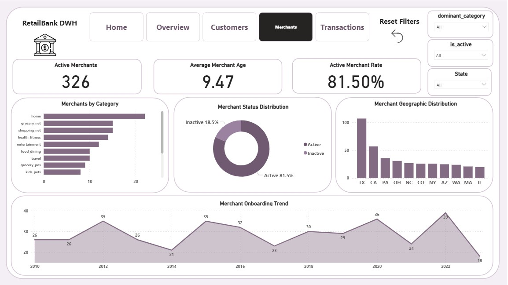
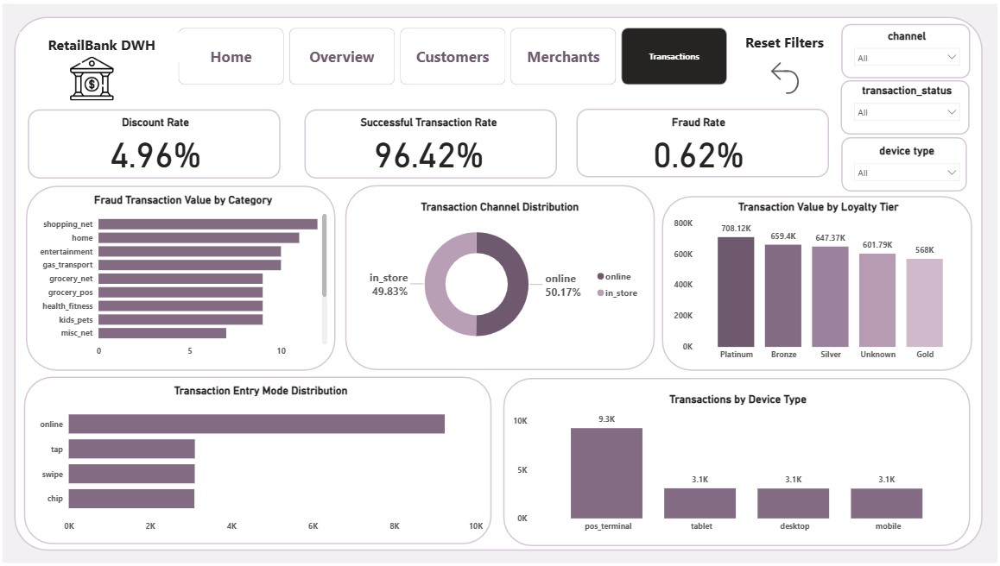

# RetailBank DWH
### End-to-End Data Warehouse & Business Intelligence Project

A production-style RetailBank Data Warehouse built using SQL Server and Power BI, following the Medallion Architecture: Bronze → Silver → Gold.

The project transforms raw banking data into clean, structured, and analysis-ready data for Business Intelligence and interactive reporting.

---

## 📊 Dashboard Preview

### Home



### Overview



### Customers


### Merchants



### Transactions



---

## 🏗️ Data Warehouse Architecture

The project follows the **Medallion Architecture** to transform raw banking data into trusted, analysis-ready information.

```text
Raw Data
   │
   ▼
┌──────────────┐
│    Bronze    │  Raw Data Ingestion
└──────┬───────┘
       │
       ▼
┌──────────────┐
│    Silver    │  Data Cleaning & Transformation
└──────┬───────┘
       │
       ▼
┌──────────────┐
│     Gold     │  Dimensional Modeling & Business Logic
└──────┬───────┘
       │
       ▼
┌──────────────┐
│   Power BI   │  Business Intelligence & Reporting
└──────────────┘

🟤 Bronze Layer

The Bronze layer stores the raw source data with minimal transformation.

The main objective is to preserve the original data and provide a reliable source for the following ETL stages.

⚪ Silver Layer

The Silver layer focuses on Data Quality and Transformation, including:

Handling NULL and invalid values.
Cleaning and standardizing text fields.
Validating data types.
Removing duplicate records where required.
Applying data quality checks.
Validating business rules.
Ensuring referential integrity between related entities.
🟡 Gold Layer

The Gold layer contains the final business-ready data model used for analytics.

A Star Schema was designed using fact and dimension tables:

FactTransactions — transaction-level business activity.
DimCustomer — customer information and attributes.
DimMerchant — merchant information and attributes.
DimDate — calendar and time-based analysis.

This structure makes the data easier to query, analyze, and connect to Power BI.

🛠️ Technologies Used
SQL Server — Database and Data Warehouse development.
T-SQL — Data Definition, Validation, Cleaning, Transformation, and ETL.
Power BI — Interactive reporting and data visualization.
DAX — KPIs, measures, rates, and analytical calculations.
Star Schema — Dimensional data modeling.
Medallion Architecture — Bronze, Silver, and Gold data layers.
📁 Project Structure
RetailBank-DWH/
│
├── 1-ddl.sql
├── 2-validation.sql
├── 3-silver.sql
├── 4-gold.sql
│
├── warehouse_bank_fin.pbix
│
├── home.jpg
├── overvieww.jpg
├── customers.jpg
├── merchants.jpg
├── transactionss.jpg
│
└── README.md
SQL Scripts
File	Description
1-ddl.sql	Database and table definitions
2-validation.sql	Data quality and validation checks
3-silver.sql	Silver-layer cleaning and transformation
4-gold.sql	Gold-layer dimensional modeling
📊 Power BI Dashboard

The final Power BI report contains four main analytical pages:

Overview

Provides a high-level view of the RetailBank business, including transaction activity, customers, merchants, revenue, fraud, and overall performance.

Customers

Analyzes customer demographics, loyalty tiers, acquisition trends, geographic distribution, and customer behavior.

Merchants

Provides insights into merchant activity, categories, active/inactive merchants, geographic distribution, and onboarding trends.

Transactions

Focuses on transaction behavior, fraud indicators, transaction channels, entry modes, device types, discounts, and transaction value.

🔎 Key Analytical Areas

The dashboard enables analysis across multiple dimensions, including:

Customer behavior
Merchant performance
Transaction activity
Transaction channels
Payment methods
Device types
Transaction entry modes
Transaction status
Discounts
Fraud activity
Loyalty tiers
Geographic distribution
Time-based trends

The goal was not only to visualize the data, but to provide a structured analytical layer that can support business questions and decision-making.

## 🎯 Project Objective

The main objective of this project was to demonstrate an End-to-End Data Warehouse and Business Intelligence workflow, starting from raw banking data and ending with interactive business reporting.

The project combines:

Data Ingestion → Data Quality → Data Transformation → Data Modeling → Business Intelligence

One of the main lessons from the project was that the quality of a dashboard depends heavily on the quality and structure of the data behind it.
